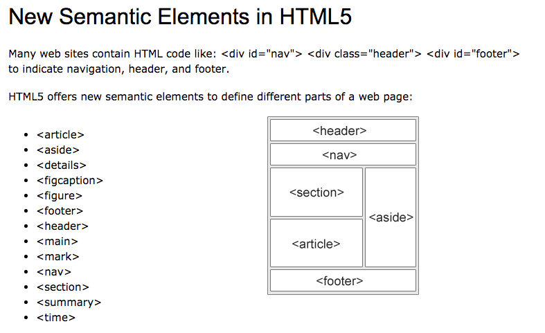

## HTML

### HTML Semantic Tags

`<main>` - for the main content of the webpage (unique to that page)

`<section>` - defines a certain section of a webpage (Blog list, contact info, etc.)

`<article>` - Defines a bit of content which makes up an article. (e.g. blogpost). is used to represent a fully self-contained region of content and still make sense on its own.

`<aside>` - Defines some content related to something else (e.g. similar blogs)

`<figcaption>` -

`<figure>` -

`<footer>` - Footer / Lowest section of a website

`<header>` - For the header of a website - contains nav, title, etc.  
`<mark>` -

`<nav>` - is designed to clearly identify the main navigation blocks on the page

`<section>` - basically just a `
` with special semantic meaning. A `<section>` begins a new "sectioning content" region, so it can have its own `<header>` and/or `<footer>`

`
` -

`<time>` -

`<address>` - is intended to call out contact info, and it's often used in the main page

#### Merksatz zu `<main>`

---

> "So `<main>` is where you put the good stuff, the important parts of a page, the reason the user came to this page in particular, not your site in general. In other words, the main content. 😯😲🤯
> All that other stuff, logos and search forms and navigation and such, can go in a `<header>` or `<footer>` within the `<body>` but outside of `<main>`.
> There must not be more than one visible main element in a document."

---
