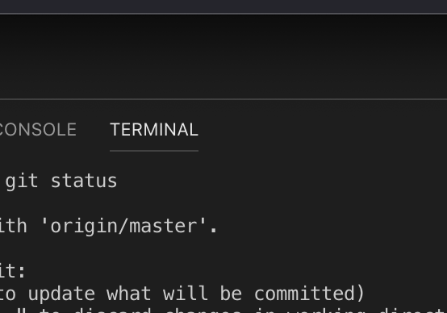

## Markdown Cheatsheet

This is my .md-Cheatsheet

## **Links**

**In Line Links** `[Text to write](http://google.com)`  
**Reference Links**`[Text to write][Reference Link]`
[Reference Link]: http://google.com

## **Formatierung**

_**Soft Break**_ > `··`  
**Bold** `**`  
_Italic_ `*`  
**Hard Break** `zwei mal Return`

**Display Code**

````
```js
code code code (In diesem Fall JavaScript)
```
````

**Headlines**  
** h1 (#) bis h6 (######)**

## **Bild einfügen aus Finder/etc.**

```

```

_Ausrufezeichen + [Alt-Text](Link)_
